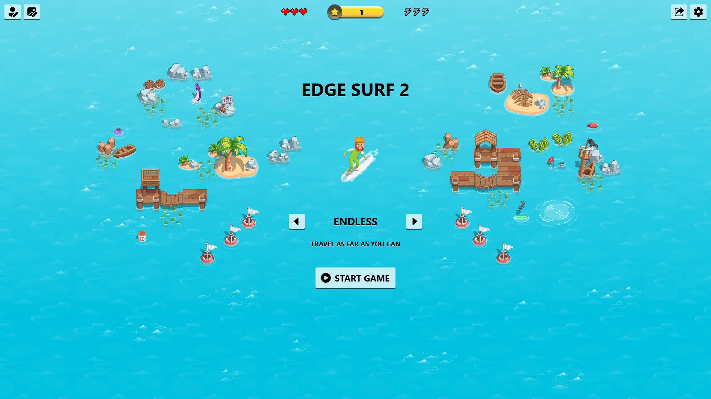

# Microsoft Edge Surf 2

## Introduction

Microsoft Edge Surf 2, updated as of Microsoft Edge v133 in 2025, [comes with improvements](https://x.com/MasterDevwi/status/1890474882183622842?mx=2):

- Remastered Graphics: Surf now features all-new graphics that retain the spirit of the original theme while leveling things up significantly.
- Themes: Prefer the original theme? You can now switch themes at any time from the new themes menu.
- Character Creator: You can now customize your player to fit your style! Choose your outfit, hairstyle, and more. We've also added fun new accessories like hats and sunglasses.
- Collector Mode: We've added a fourth mode to the game—Collector! Try to collect as many coins as you can for the highest score.
- Improved Navigation: You can now switch between game modes right from the game's homepage. It's never been easier to play Endless, Time Trial, Zig Zag, or Collector!
- High Score: Track your progress toward your high score with the new progress bar. Can you fill up the bar and beat your high score?

## Why Edge Surf 2 and not just update the [Edge Surf's repo](https://github.com/yell0wsuit/ms-edge-letssurf)?

While Edge Surf 2 introduces numerous enhancements, some beloved features of Edge Surf—like the Linux Tux character and ski theme—are still missing. To honor the legacy of Edge Surf while expanding its horizons, we’ve decided to create a separate repository for Edge Surf 2, keeping the original intact.

Eventually, once Edge Surf 2 fully integrates all of the features from Edge Surf, it may serve as a complete replacement. For now, both versions remain available.

Please note that "Edge Surf 2" is an informal name for the newly updated version and not the official title.
